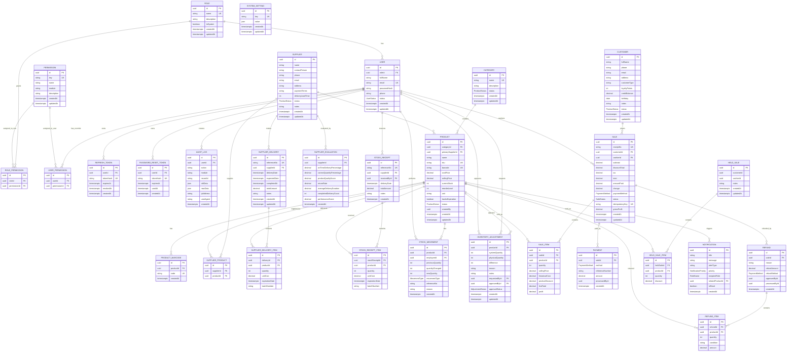

# SmartStock Entity Relationship Diagram

This ERD is based on `backend/prisma/schema.prisma`.

```mermaid
erDiagram
  ROLE ||--o{ USER : has
  ROLE ||--o{ ROLE_PERMISSION : grants
  PERMISSION ||--o{ ROLE_PERMISSION : assigned_to_role
  USER ||--o{ USER_PERMISSION : has_override
  PERMISSION ||--o{ USER_PERMISSION : assigned_to_user

  USER ||--o{ REFRESH_TOKEN : owns
  USER ||--o{ PASSWORD_RESET_TOKEN : owns
  USER ||--o{ AUDIT_LOG : creates

  CATEGORY ||--o{ PRODUCT : contains
  SUPPLIER ||--o{ PRODUCT : primary_supplier
  PRODUCT ||--o{ PRODUCT_BARCODE : has
  SUPPLIER ||--o{ SUPPLIER_PRODUCT : supplies
  PRODUCT ||--o{ SUPPLIER_PRODUCT : supplied_by

  SUPPLIER ||--o{ SUPPLIER_DELIVERY : makes
  SUPPLIER_DELIVERY ||--o{ SUPPLIER_DELIVERY_ITEM : contains
  PRODUCT ||--o{ SUPPLIER_DELIVERY_ITEM : delivered
  SUPPLIER ||--o{ SUPPLIER_EVALUATION : evaluated_by

  USER ||--o{ STOCK_RECEIPT : receives
  STOCK_RECEIPT ||--o{ STOCK_RECEIPT_ITEM : contains
  PRODUCT ||--o{ STOCK_RECEIPT_ITEM : received
  PRODUCT ||--o{ STOCK_MOVEMENT : has
  USER ||--o{ STOCK_MOVEMENT : performs

  PRODUCT ||--o{ INVENTORY_ADJUSTMENT : adjusted
  USER ||--o{ INVENTORY_ADJUSTMENT : requests
  USER ||--o{ INVENTORY_ADJUSTMENT : approves

  CUSTOMER ||--o{ SALE : places
  USER ||--o{ SALE : cashiers
  SALE ||--o{ SALE_ITEM : contains
  PRODUCT ||--o{ SALE_ITEM : sold_as
  SALE ||--o{ PAYMENT : paid_by
  SALE ||--o{ REFUND : refunded_by
  REFUND ||--o{ REFUND_ITEM : contains
  PRODUCT ||--o{ REFUND_ITEM : returned

  HELD_SALE ||--o{ HELD_SALE_ITEM : contains
  PRODUCT ||--o{ HELD_SALE_ITEM : held_as

  PRODUCT ||--o{ NOTIFICATION : triggers

  ROLE {
    uuid id PK
    string name UK
    string description
    boolean isSystem
    timestamptz createdAt
    timestamptz updatedAt
  }

  PERMISSION {
    uuid id PK
    string key UK
    string name
    string module
    string description
    timestamptz createdAt
    timestamptz updatedAt
  }

  ROLE_PERMISSION {
    uuid id PK
    uuid roleId FK
    uuid permissionId FK
  }

  USER_PERMISSION {
    uuid id PK
    uuid userId FK
    uuid permissionId FK
  }

  USER {
    uuid id PK
    uuid roleId FK
    string fullName
    string email UK
    string passwordHash
    string phone
    UserStatus status
    timestamptz createdAt
    timestamptz updatedAt
  }

  CATEGORY {
    uuid id PK
    string name UK
    string description
    ProductStatus status
    timestamptz createdAt
    timestamptz updatedAt
  }

  PRODUCT {
    uuid id PK
    uuid categoryId FK
    uuid primarySupplierId FK
    string name
    string sku UK
    string barcode UK
    decimal costPrice
    decimal sellingPrice
    int currentStock
    int reorderLevel
    string unit
    boolean tracksExpiration
    ProductStatus status
    uuid createdBy
    timestamptz createdAt
    timestamptz updatedAt
  }

  PRODUCT_BARCODE {
    uuid id PK
    uuid productId FK
    string code UK
    timestamptz createdAt
  }

  SUPPLIER {
    uuid id PK
    string name
    string contactPerson
    string phone
    string email
    string address
    string paymentTerms
    int deliveryLeadTime
    ProductStatus status
    string notes
    timestamptz createdAt
    timestamptz updatedAt
  }

  SUPPLIER_PRODUCT {
    uuid id PK
    uuid supplierId FK
    uuid productId FK
  }

  SUPPLIER_DELIVERY {
    uuid id PK
    string referenceNo UK
    uuid supplierId FK
    timestamptz deliveryDate
    timestamptz expectedDate
    timestamptz completedAt
    decimal totalAmount
    string notes
    timestamptz createdAt
    timestamptz updatedAt
  }

  SUPPLIER_DELIVERY_ITEM {
    uuid id PK
    uuid deliveryId FK
    uuid productId FK
    int quantity
    decimal unitCost
    timestamptz expirationDate
    string batchNumber
  }

  SUPPLIER_EVALUATION {
    uuid id PK
    uuid supplierId FK
    decimal onTimeDeliveryPercentage
    decimal correctQuantityPercentage
    decimal productQualityScore
    decimal returnRate
    decimal averageDeliveryDuration
    int completedDeliveryCount
    decimal performanceScore
    timestamptz createdAt
  }

  CUSTOMER {
    uuid id PK
    string fullName
    string phone
    string email
    string address
    string customerType
    int loyaltyPoints
    decimal creditBalance
    date birthday
    string notes
    ProductStatus status
    timestamptz createdAt
    timestamptz updatedAt
  }

  STOCK_RECEIPT {
    uuid id PK
    string referenceNo UK
    uuid supplierId FK
    uuid receivedById FK
    timestamptz deliveryDate
    decimal totalAmount
    string notes
    timestamptz createdAt
  }

  STOCK_RECEIPT_ITEM {
    uuid id PK
    uuid stockReceiptId FK
    uuid productId FK
    int quantity
    decimal unitCost
    timestamptz expirationDate
    string batchNumber
  }

  STOCK_MOVEMENT {
    uuid id PK
    uuid productId FK
    uuid employeeId FK
    int previousQuantity
    int quantityChanged
    int newQuantity
    MovementType movementType
    string referenceNo
    string reason
    timestamptz createdAt
  }

  INVENTORY_ADJUSTMENT {
    uuid id PK
    uuid productId FK
    int systemQuantity
    int physicalQuantity
    int difference
    string reason
    string notes
    uuid requestedById FK
    uuid approvedById FK
    AdjustmentStatus approvalStatus
    timestamptz createdAt
    timestamptz updatedAt
  }

  SALE {
    uuid id PK
    string receiptNo UK
    uuid customerId FK
    uuid cashierId FK
    decimal subtotal
    decimal discountTotal
    decimal tax
    decimal total
    decimal amountPaid
    decimal change
    PaymentMethod paymentMethod
    SaleStatus status
    string idempotencyKey UK
    decimal grossProfit
    timestamptz createdAt
    timestamptz updatedAt
  }

  SALE_ITEM {
    uuid id PK
    uuid saleId FK
    uuid productId FK
    int quantity
    decimal sellingPrice
    decimal historicalCost
    decimal productDiscount
    decimal lineTotal
    decimal profit
  }

  HELD_SALE {
    uuid id PK
    uuid customerId
    uuid cashierId
    string notes
    timestamptz createdAt
    timestamptz updatedAt
  }

  HELD_SALE_ITEM {
    uuid id PK
    uuid heldSaleId FK
    uuid productId FK
    int quantity
    decimal discount
  }

  PAYMENT {
    uuid id PK
    uuid saleId FK
    PaymentMethod method
    string referenceNumber
    decimal amount
    uuid processedById
    timestamptz createdAt
  }

  REFUND {
    uuid id PK
    uuid saleId FK
    string reason
    decimal refundAmount
    PaymentMethod refundMethod
    uuid approvedById
    uuid processedById
    timestamptz createdAt
  }

  REFUND_ITEM {
    uuid id PK
    uuid refundId FK
    uuid productId FK
    int quantity
    string condition
    decimal amount
  }

  NOTIFICATION {
    uuid id PK
    string title
    string message
    string alertType
    NotificationPriority priority
    RoleName recipientRole
    uuid relatedProductId FK
    boolean isRead
    timestamptz createdAt
  }

  AUDIT_LOG {
    uuid id PK
    uuid userId FK
    string action
    string module
    string recordId
    json oldData
    json newData
    string ipAddress
    string userAgent
    timestamptz createdAt
  }

  REFRESH_TOKEN {
    uuid id PK
    uuid userId FK
    string tokenHash UK
    timestamptz expiresAt
    timestamptz revokedAt
    timestamptz createdAt
  }

  PASSWORD_RESET_TOKEN {
    uuid id PK
    uuid userId FK
    string tokenHash UK
    timestamptz expiresAt
    timestamptz usedAt
    timestamptz createdAt
  }

  SYSTEM_SETTING {
    uuid id PK
    string key UK
    json value
    timestamptz createdAt
    timestamptz updatedAt
  }
```
