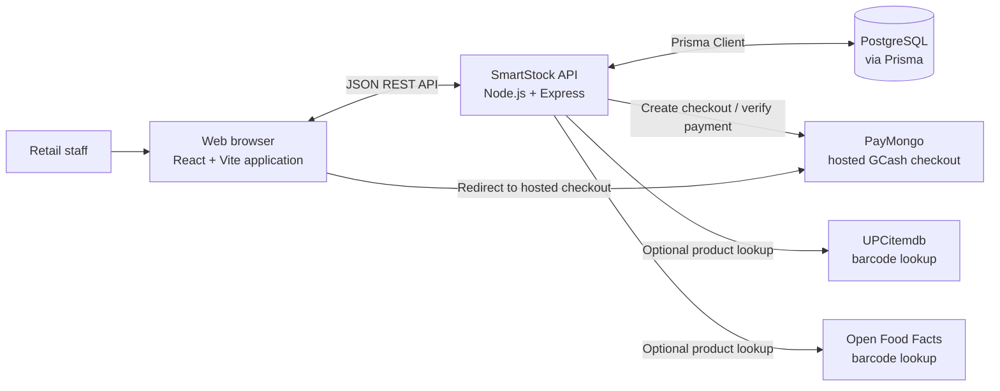
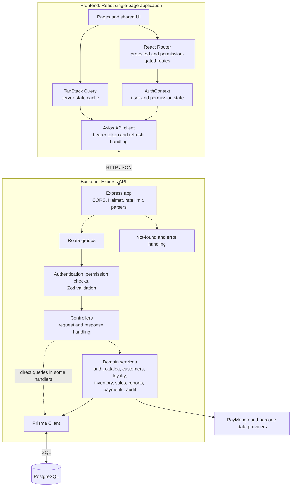
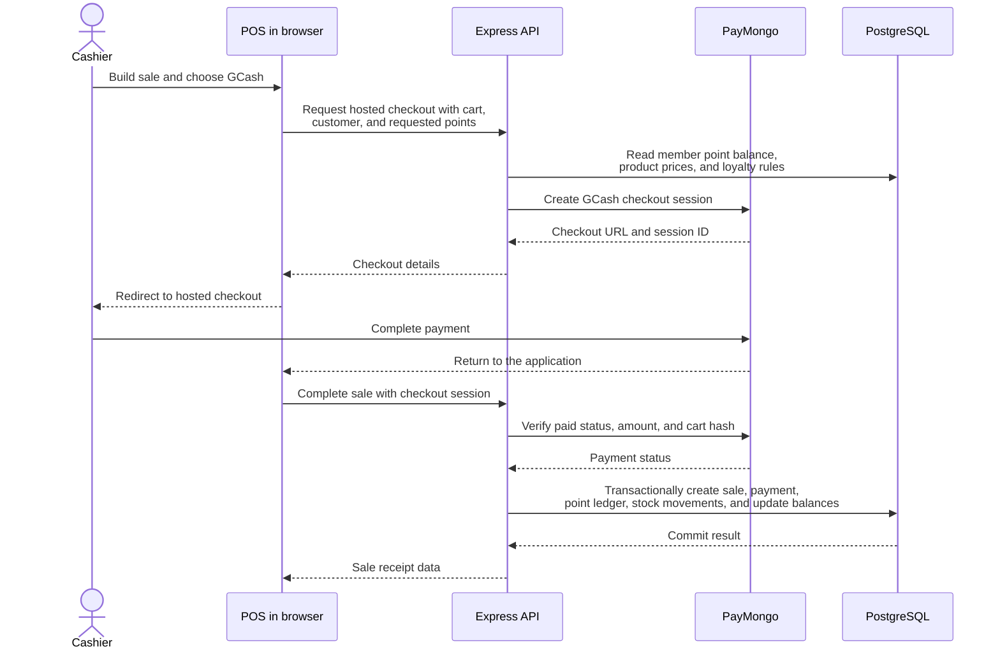

# SmartStock System Architecture

This document describes the architecture implemented in this repository. See [SYSTEM_DESIGN.md](SYSTEM_DESIGN.md) for workflows, data consistency rules, and operating constraints; the database entities and relationships are detailed separately in [ERD.md](ERD.md).

## System context

SmartStock is a browser-based inventory, point-of-sale, and reporting application. The browser communicates with the Express API. The API reads and writes operational data in PostgreSQL through Prisma and calls external services for hosted GCash checkout and optional barcode lookups.

PayMongo credentials remain on the backend. The API creates hosted checkout sessions and checks their status; the browser receives the checkout URL and redirects the cashier to PayMongo. Barcode lookup is handled by the API, which can use UPCitemdb and Open Food Facts.

## Application components

### Frontend

- `frontend/src/App.tsx` defines the page routes and wraps the app in React Query, authentication, and browser routing providers.
- Page components and shared UI provide the inventory, POS, sales, supplier, customer, administration, notification, and reporting screens.
- `AuthContext` restores the signed-in session and exposes the current user and permissions. Route guards improve navigation behavior; API permission checks remain authoritative.
- `frontend/src/services/api.ts` is the shared Axios client. It attaches the in-memory access token and coordinates refresh attempts after an unauthorized response. API requests include credentials so the refresh cookie can be sent.
- TanStack Query is used by the pages for server data; client-side report exporters produce downloadable files in the browser.

### Backend

- `backend/src/server.ts` starts the HTTP listener; `backend/src/app.ts` configures middleware, static `/uploads` serving, health check, API route mounts, and centralized error handling.
- Route modules group endpoints by authentication, catalog, inventory/POS, payments, and administration/reporting concerns.
- Routes apply authentication, permission checks, and Zod body validation where defined. Controllers coordinate request handling and API responses. Domain rules live in services where present; some controllers also use Prisma directly.
- `backend/src/config/env.ts` validates backend environment settings at startup. `backend/src/config/prisma.ts` creates the shared Prisma client.
- Prisma schema and migrations define PostgreSQL persistence. Database changes for sales and inventory operations use transactions where consistency across records is required.

## Main request and business flows

### Authenticated API request

1. The frontend sends a REST request with the access token in the `Authorization: Bearer` header. The refresh token is stored in an HttpOnly cookie.
2. The API verifies the access token and loads the active user, role permissions, and user-specific permission grants from PostgreSQL.
3. Route middleware checks the required permission. Validated request bodies are parsed with Zod before the controller runs.
4. The controller and, where applicable, a domain service read or update data through Prisma.
5. The API returns a JSON response. The centralized error handler maps validation, application, and known Prisma errors to API errors.

Permissions are the union of a user's role permissions and explicit user permissions. This is enforced on the backend for protected API routes.

### POS sale and GCash checkout

The sale operation locks the customer and product rows, checks current stock, recalculates customer pricing and loyalty points, uses an idempotency key, and records sale/payment/inventory/loyalty changes in one database transaction. A failed database transaction does not leave partial point or stock changes. The current integration verifies checkout status through the PayMongo API; the mounted API routes do not include a payment webhook endpoint.

### Inventory changes

Stock-in, stock-out, sale, refund, and adjustment operations update stock quantities and write stock movement records. Relevant inventory workflows also create low-stock notifications. Adjustment requests may require a second user to approve them. These records support inventory history, alerts, audit review, and reports.

## Domain areas

The API groups functionality into these areas:

- **Identity and access:** login, refresh, logout, password changes, users, roles, and permissions.
- **Catalog and suppliers:** products, categories, barcodes, supplier relationships, supplier delivery data, and customers.
- **Customer management and loyalty:** registered and anonymous member accounts, printable QR cards, purchase history, member points, and server-managed member pricing. All saved customer accounts use the Member type; walk-in checkout without a saved customer uses retail pricing.
- **Inventory:** stock receipts, stock-out, adjustments, stock movements, low-stock notifications, and held sales.
- **Sales and payments:** POS completion, sales history, refunds, and PayMongo GCash checkout.
- **Operations and reporting:** dashboard metrics, reports, settings, notifications, and audit logs.

`ERD.md` documents the persisted models, including customer pricing fields, loyalty transactions, sales, inventory movements, payments, roles, permissions, notifications, and audit records.

## Security and cross-cutting behavior

- Access tokens are short-lived JWTs held in frontend memory. Refresh tokens are issued in an HttpOnly cookie and represented by stored hashes in the database.
- Passwords are hashed with bcrypt. Backend configuration validates required database and JWT settings at startup.
- Express applies Helmet, credentialed CORS for the configured client URL and local development origins, request rate limiting, and centralized error handling.
- Zod schemas validate request bodies on routes that declare validation middleware. Authentication and role/user permission checks are performed by backend middleware.
- The API response serializer removes sensitive fields before returning data.
- `PAYMONGO_SECRET_KEY` and barcode-provider settings are backend environment configuration; secrets should not be placed in the browser build.

## Runtime and deployment

The repository documents a local development setup with the Vite frontend on `http://localhost:5173`, the Express API on `http://localhost:5000`, and PostgreSQL configured through `DATABASE_URL`. `npm run dev` starts the frontend and backend together. The frontend API base URL can be set with `VITE_API_URL`; otherwise it defaults to `http://localhost:5000/api`.

The repository does not define a production hosting platform or deployment manifest. A hosted deployment therefore needs separate frontend, API, PostgreSQL, and secret configuration appropriate to its chosen provider. The backend can serve files from its configured uploads directory at `/uploads`.

The current repository runs request handling in the API process; it does not define a background worker or message queue. Password reset tokens can be created and consumed, but email delivery is not implemented.
